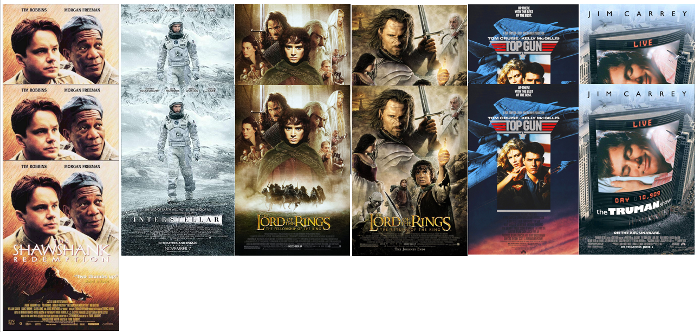
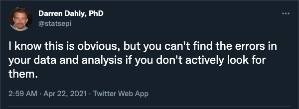

# 431 Class 04: 2022-09-08

[Main Website](https://thomaselove.github.io/431-2022/) | [Calendar](https://thomaselove.github.io/431-2022/calendar.html) | [Syllabus](https://thomaselove.github.io/431-syllabus-2022/) | [Notes](https://thomaselove.github.io/431-notes/) | [Contact Us](https://thomaselove.github.io/431-2022/contact.html) | [Canvas](https://canvas.case.edu) | [Data and Code](https://github.com/THOMASELOVE/431-data)
:-----------: | :--------------: | :----------: | :---------: | :-------------: | :-----------: | :------------:
for everything | for deadlines | expectations | from Dr. Love | ways to get help | lab submission | for downloads

## Today's Slides

Class | HTML Link to Slides | Date | Quarto file (download) | Recording
:---: | :------------: | :---: | :--------------: | :----: 
04 | [Slides for Class 04](https://thomaselove.github.io/431-slides-2022/class04.html) | 2022-09-08 | [Quarto for Class 04 slides](https://thomaselove.github.io/431-slides-2022/class04.qmd) | To be posted.

## Quote of the Day

> We also seem to be wired to jump to conclusions on the basis of small amounts of information. Ultimately I guess it comes back to the fact that the world is more complicated than any of us are capable of understanding. (Bill James)

## Announcements

1. Feedback from the [Minute Paper after Class 03](https://bit.ly/431-2022-min03-feedback) is now available.
2. Detailed instructions for [Project A](https://thomaselove.github.io/431-2022/assignments.html#project-a) will be available next week.
3. Here are ten more of the interesting or fun facts about you that you included in the [Welcome to 431 Survey](https://bit.ly/431-2022-welcome-survey).
    - I drove from Atlanta to Los Angeles and back on a road trip with friends (about 4400 miles, or 7000 kilometers.) 
    - I am a big University of North Carolina basketball fan.
    - I absolutely love to cook! I just tried my first Michelin star restaurant in Chicago this summer.
    - I am learning Spanish, and that will be my third language.
    - No matter what time of the day it is or what my current mood is, I will never say no to Biryani (an Indian Mughlai delicacy prepared from rice, chicken, and tons of spices.)
    - I have 7 dogs at my parents' house.
    - I have a ten year old daughter who is on a swim team.
    - I have a three-legged dog! She is a rescued pitbull and now she has a great life!
    - I joined Case's amateur radio club and am looking forward to getting my ham radio license.
    - I like photography and got to photograph Neil deGrasse Tyson when he spoke at my undergrad institution.

## Favorite Movies

- We've now got 62 responses, describing 55 of your favorite movies. Thanks! 
- A data set of 159 films mentioned by students in 2020-2022 (44 of which are new to the list this year) is in the **movies_2022-09-08** sheet on our Shared Drive.
- Movies mentioned by more than one student this year are:

## What Should I Be Working On?

1. Complete [Lab 01](https://github.com/THOMASELOVE/431-labs-2022) and submit to [Canvas](https://canvas.case.edu/) by its deadline: Monday 2022-09-12 at 9 PM.
2. Read Spiegelhalter at least through Chapter 1.
3. Ask questions (if you desire) through [Campuswire](https://campuswire.com/) or [TA office hours](https://thomaselove.github.io/431-2022/contact.html).

## One Last Thing

See [here](https://twitter.com/statsepi/status/1385126000149807105) for his 7-steps.

