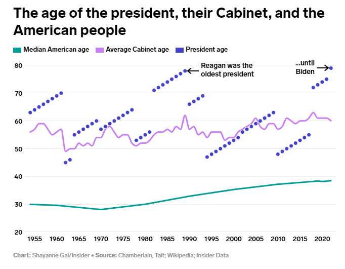

# 431 Class 09: 2022-09-27

[Main Website](https://thomaselove.github.io/431-2022/) | [Calendar](https://thomaselove.github.io/431-2022/calendar.html) | [Syllabus](https://thomaselove.github.io/431-syllabus-2022/) | [Notes](https://thomaselove.github.io/431-notes/) | [Contact Us](https://thomaselove.github.io/431-2022/contact.html) | [Canvas](https://canvas.case.edu) | [Data and Code](https://github.com/THOMASELOVE/431-data)
:-----------: | :--------------: | :----------: | :---------: | :-------------: | :-----------: | :------------:
for everything | for deadlines | expectations | from Dr. Love | ways to get help | lab submission | for downloads

## Today's Slides

Class | Date | Reveal JS (HTML) | Quarto .qmd | PDF file | Recording
:---: | :--------: | :------: | :------: | :--------: | :-------------:
09 | 2022-09-27 | **[Slides 09](https://thomaselove.github.io/431-slides-2022/class09.html)** | [Code 09](https://thomaselove.github.io/431-slides-2022/class09.qmd) | [PDF 09](431%20Class%2009.pdf) | Visit [Canvas](https://canvas.case.edu/), select **Zoom** and **Cloud Recordings**

## Tweet of the Day

  [Link](https://twitter.com/andyperfors/status/1573188014909849601)

## Announcements

1. There is a [Minute Paper after Class 09](https://bit.ly/431-2022-min-09), due tomorrow (2022-09-28) at noon.
2. The Answer Sketch for [Lab 2](https://github.com/THOMASELOVE/431-labs-2022) is now available on our Shared Drive. [Lab 3](https://github.com/THOMASELOVE/431-labs-2022) is due next Monday 2022-10-03 at 9 PM.
3. The early deadline for [Project A Proposal](https://thomaselove.github.io/431-projectA-2022/) review is at noon next Monday, 2022-10-03.
4. Applications are now open for the [2022 NCHS/AcademyHealth Data Visualization Challenge](https://academyhealth.org/NCHSData). This Data Visualization Challenge is geared towards U.S. graduate students (must be US citizens) who are interested in innovating the statistical display of public health trends for various target audiences. The Challenge serves as an opportunity for those who are looking to earn visibility and experience as a public health or data science researcher. Graduate students (masters or doctoral) of any academic discipline may apply as individuals or in teams of up to 3 people. The application cycle closes 2022-11-14 at 5 PM EST.
5. There is a lot of R material on YouTube. Today, I'll call your attention to two items in particular.
    - [Whole game](https://www.youtube.com/watch?v=go5Au01Jrvs) by Hadley Wickham from 2018 (about 22 minutes). Hadley works in an R Markdown document and analyzes some real data.
    - [Understand the gender pay gap three ways](https://www.youtube.com/watch?v=qu2wsbIeedY) by Julia Silge (about 32 minutes). Part of a series where Julia looks at data from the [TidyTuesday project](https://github.com/rfordatascience/tidytuesday). Check out Julia's [code for this video on her blog](https://juliasilge.com/blog/pay-gap-uk/).
    - [How to copy website table data to R with the datapasta package](https://www.youtube.com/watch?v=YAkfDQgghzk) by Lyndon Walker (about 6 minutes.) Lyndon demonstrates the use of [the `datapasta` package](https://github.com/MilesMcBain/datapasta).
6. Quiz 1 looms. I will provide you with a copy of the (general) instructions for the Quiz as part of Class 10, so you'll have a better understanding of what is ahead of you.

## One Last Thing

From [Flowing Data](https://flowingdata.com/2022/09/19/oldest-u-s-government/): A note on "[Oldest U.S. Government](https://flowingdata.com/2022/09/19/oldest-u-s-government/)" from 2022-09-19. Here, we are guided towards the straightforward [charts from Annie Fu, Walt Hickey and Shayanne Gal at Insider](https://www.businessinsider.com/gerontocracy-united-states-congress-red-white-and-gray-data-charts-2022-9). Two examples follow:

> You expect age across most occupations to increase with life expectancy, but this seems a bit much.

