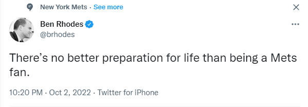
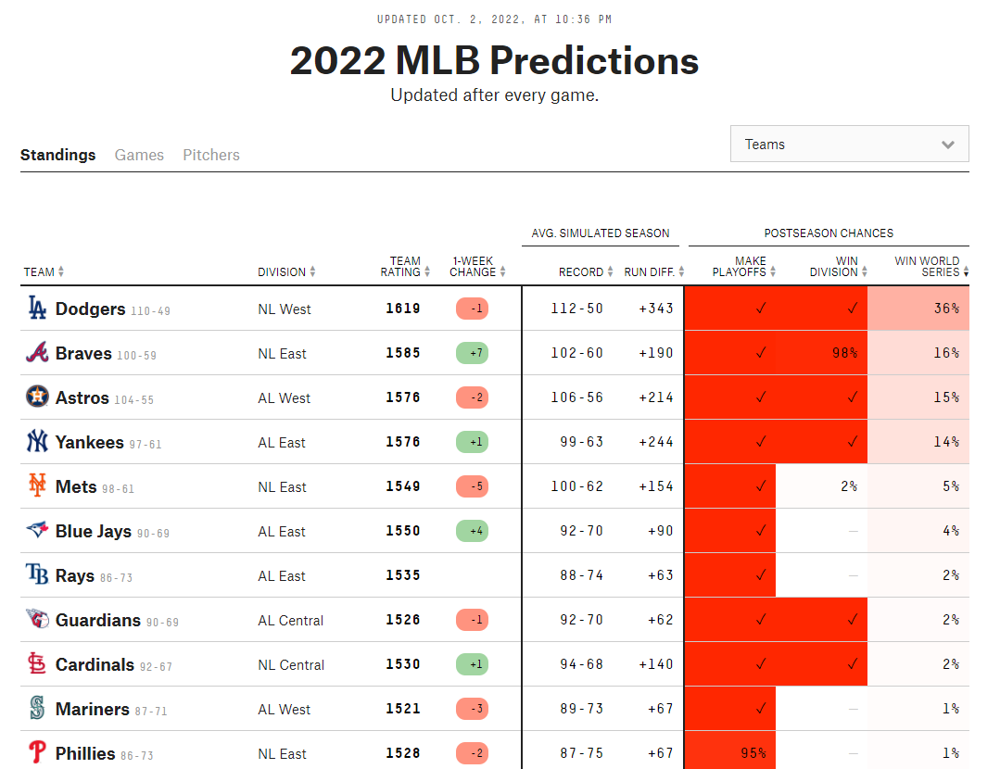

# 431 Class 11: 2022-10-04

[Main Website](https://thomaselove.github.io/431-2022/) | [Calendar](https://thomaselove.github.io/431-2022/calendar.html) | [Syllabus](https://thomaselove.github.io/431-syllabus-2022/) | [Notes](https://thomaselove.github.io/431-notes/) | [Contact Us](https://thomaselove.github.io/431-2022/contact.html) | [Canvas](https://canvas.case.edu) | [Data and Code](https://github.com/THOMASELOVE/431-data)
:-----------: | :--------------: | :----------: | :---------: | :-------------: | :-----------: | :------------:
for everything | for deadlines | expectations | from Dr. Love | ways to get help | lab submission | for downloads

## Today's Slides

Class | Date | Reveal JS (HTML) | Quarto .qmd | PDF file | Recording
:---: | :--------: | :------: | :------: | :--------: | :-------------:
11 | 2022-10-04 | **[Slides 11](https://thomaselove.github.io/431-slides-2022/class11.html)** | [Code 11](https://thomaselove.github.io/431-slides-2022/class11.qmd) | [PDF 11](431%20Class%2011.pdf) | Visit [Canvas](https://canvas.case.edu/), select **Zoom** and **Cloud Recordings**



## Announcements

1. There is a [Minute Paper after Class 11](https://bit.ly/431-2022-min-11) due Wednesday 2022-10-05 at noon.
2. The Lab 3 Answer Sketch and Grading Rubric will be posted **by class time**.
3. [Grades and feedback on Lab 2](https://github.com/THOMASELOVE/431-labs-2022/blob/main/README.md#answer-sketches-and-grading-rubrics) are now available in the Course Grading Roster on our Shared Drive.
4. Part B (Chapters 18-28) of [the Course Notes](https://thomaselove.github.io/431-notes/) is now available. I also made minor corrections to Sections 13.7 and 14.5 to make things a bit clearer and avoid the use of the `%>%` pipe.
5. Thanks to those of you who [met the early deadline for the Project A proposal](https://github.com/THOMASELOVE/431-classes-2022/blob/main/projectA/early_prop.md). You'll get feedback as soon as possible.
6. All elements of the actual Quiz [will be available](https://github.com/THOMASELOVE/431-quizzes-2022/blob/main/quiz1) at 5 PM Thursday 2022-10-06, and Quiz 1 is due 2022-10-10 at 9 PM.
7. The code for Slide 9 in Class 10 is now shown in the [slides for class 10](https://thomaselove.github.io/431-slides-2022/class10.html) and the [PDF for class 10](https://github.com/THOMASELOVE/431-classes-2022/blob/main/class10/431%20Class%2010.pdf). The [`geom_miss_point()` function](https://naniar.njtierney.com/reference/geom_miss_point.html) comes from [the `naniar` package](https://naniar.njtierney.com/index.html).

```
ggplot(data = bp_full, aes(x = res_1, y = ninc_1)) +
  geom_miss_point()
```

8. **Sources of R Examples** Almost every R idea I demonstrate and discuss in the slides, or expect you to work through in a Lab, can also be found in:
    - the [Course Notes](https://thomaselove.github.io/431-notes/) and 
    - in [R for Data Science](https://r4ds.hadley.nz/) and many also appear 
    - in the [R Graphics Cookbook](https://r-graphics.org/). I encourage you to use those resources. It's what I do.
9. I'm experimenting with something on Campuswire that might be worth your time. Take a look if you get the chance before tomorrow at noon.

## Today's Activity

- Here is the link to [today's breakout activity](https://github.com/THOMASELOVE/431-classes-2022/blob/main/movies/breakout1.md).
- Here is the link to the [main page about the favorite movies work](https://github.com/THOMASELOVE/431-classes-2022/tree/main/movies).

## Join The American Statistical Association for $25!

I encourage anyone who's interested to [become a student member of the American Statistical Association](http://amstat.informz.net/z/cjUucD9taT0xMDc1NzYzMSZwPTEmdT0xMTY0ODk4NDg4JmxpPTk3MzM0MDk2/index.html). For many of you, at $25 per year, it's a steal.

## One Last Thing



Source: [FiveThirtyEight 2022 MLB Predictions](https://projects.fivethirtyeight.com/2022-mlb-predictions/)
