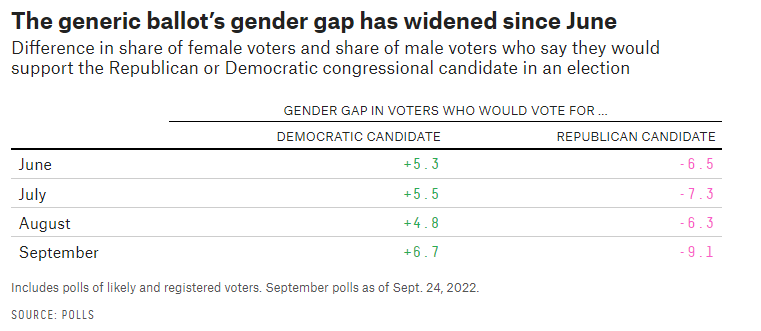

# 431 Class 12: 2022-10-06

[Main Website](https://thomaselove.github.io/431-2022/) | [Calendar](https://thomaselove.github.io/431-2022/calendar.html) | [Syllabus](https://thomaselove.github.io/431-syllabus-2022/) | [Notes](https://thomaselove.github.io/431-notes/) | [Contact Us](https://thomaselove.github.io/431-2022/contact.html) | [Canvas](https://canvas.case.edu) | [Data and Code](https://github.com/THOMASELOVE/431-data)
:-----------: | :--------------: | :----------: | :---------: | :-------------: | :-----------: | :------------:
for everything | for deadlines | expectations | from Dr. Love | ways to get help | lab submission | for downloads

## Today's Slides

Class | Date | Reveal JS (HTML) | Quarto .qmd | PDF file | Recording
:---: | :--------: | :------: | :------: | :--------: | :-------------:
12 | 2022-10-06 | **[Slides 12](https://thomaselove.github.io/431-slides-2022/class12.html)** | [Code 12](https://thomaselove.github.io/431-slides-2022/class12.qmd) | [PDF 12](431%20Class%2012.pdf) | Visit [Canvas](https://canvas.case.edu/), select **Zoom** and **Cloud Recordings**

## Announcements

1. [Quiz 1](https://github.com/THOMASELOVE/431-quizzes-2022/tree/main/quiz1) will be available to you by 5 PM today.
2. Feedback on the Minute Paper after Class 11 will be available **by class time**.
3. I hope that detailed Comments on the Early Project A Presentations will appear **by class time**.
4. Tom Mock, at RStudio, presents [Beautiful reports and presentations with Quarto](https://www.youtube.com/watch?v=hbf7Ai3jnxY) if you are interested.
5. Jared Wilber's [Linear Regression: A Visual Introduction to (Almost) Everything You Should Know](https://mlu-explain.github.io/linear-regression/) is fantastic.

## What Should You Be Working On This Weekend?

- [Quiz 1](https://github.com/THOMASELOVE/431-quizzes-2022/tree/main/quiz1) due Monday at 9 PM.
- Work on your [Project A Proposal](https://thomaselove.github.io/431-projectA-2022/proposal.html) (main submission date is Friday 2022-10-14 at NOON.)

## Favorite Movies

1. We had nine groups of students go through the first breakout activity. For five of those groups, they'd all seen Avatar (#5 on the list), which I actually haven't seen. Three other groups found connections at The Dark Knight (#26), Despicable Me (#29) and Harry Potter and the Sorcerer's Stone (#55), but one group (of 6 people - the "No Time for Movies" group couldn't find any movie they'd all seen.
2. [Suggested exploratory questions from the first breakout activity are here](https://github.com/THOMASELOVE/431-classes-2022/blob/main/movies/breakout1_results.md). Detailed statistical results will be the main work for today's slides.

## One Last Thing

Source: Amelia Thomson-DeVeaux and Meredith Conroy at FiveThirtyEight: [Women Have Swung Toward Democrats Since The Dobbs Decision](https://fivethirtyeight.com/features/women-have-swung-toward-democrats-since-the-dobbs-decision/), published 2022-09-28.
