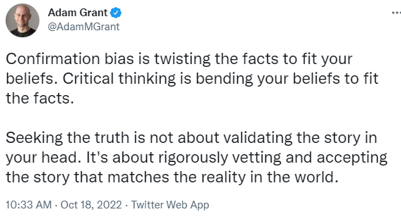

# 431 Class 15: 2022-10-27

[Main Website](https://thomaselove.github.io/431-2022/) | [Calendar](https://thomaselove.github.io/431-2022/calendar.html) | [Syllabus](https://thomaselove.github.io/431-syllabus-2022/) | [Notes](https://thomaselove.github.io/431-notes/) | [Contact Us](https://thomaselove.github.io/431-2022/contact.html) | [Canvas](https://canvas.case.edu) | [Data and Code](https://github.com/THOMASELOVE/431-data)
:-----------: | :--------------: | :----------: | :---------: | :-------------: | :-----------: | :------------:
for everything | for deadlines | expectations | from Dr. Love | ways to get help | lab submission | for downloads

## Today's Slides

Class | Date | Reveal JS (HTML) | Quarto .qmd | PDF file | Recording
:---: | :--------: | :------: | :------: | :--------: | :-------------:
15 | 2022-10-27 | **[Slides 15](https://thomaselove.github.io/431-slides-2022/class15.html)** | [Code 15](https://thomaselove.github.io/431-slides-2022/class15.qmd) | [PDF 15](431%20Class%2015.pdf) | Visit [Canvas](https://canvas.case.edu/), select **Zoom** and **Cloud Recordings**

 [Link](https://twitter.com/adammgrant/status/1582379253479354368)

## New Schedule

- Today is Class 15.
- Classes 16 and 17 have been shifted to 2022-11-01 and 2022-11-03, and the Minute Paper will be due Friday 11-04 after Class 17 instead of Wednesday.
- The Project A deadline has been pushed back to Wednesday 2022-11-02 at 10 PM.
- Class 18 will be a recording, made available no later than Election Day (2022-11-08), when we won't have class in person.
- We'll be back to the original schedule with Class 19 on 2022-11-10.

## Announcements

1. Feedback from the Minute Paper after Class 14 [is now available](https://bit.ly/431-2022-min14-feedback).
2. The Lab 04 Sketch and Rubric are now available on our Shared Google Drive.
3. Here are some [summary statistics based on the currently accepted proposals](https://github.com/THOMASELOVE/431-classes-2022/blob/main/projectA/proposal_status.md#some-summary-statistics-through-47-accepted-proposals) for Project A.
    - To ease the transition to the final version of the project (including Analyses) I have created a [Sample Project A](https://thomaselove.github.io/431-projectA-2022/exampleC.html) and then reproduced it using four different themes. I **strongly** suggest using one of these documents to build your final report due 2022-10-31. 
4. All 35 chapters of [Course Notes](https://thomaselove.github.io/431-notes/) that I plan to post this semester are now available.

## What Should I Be Working On?

1. [Project A](https://thomaselove.github.io/431-projectA-2022/) now due Wednesday 2022-11-02 at 10 PM. 
    - See my comments in [today's slides](https://thomaselove.github.io/431-slides-2022/class15.html).
    - See also my [revised Sample Project A](https://thomaselove.github.io/431-projectA-2022/exampleC.html) documents, this [description of what's changed since the Proposal](https://github.com/THOMASELOVE/431-classes-2022/blob/main/projectA/changes_from_proposal.md), and the updated final report [instructions](https://thomaselove.github.io/431-projectA-2022/report.html) and [checklist](https://thomaselove.github.io/431-projectA-2022/check_final.html).
2. Get started on building your own website for (bonus) [Lab X](https://github.com/THOMASELOVE/431-labs-2022/blob/main/labX.md).

## One Last Thing

- FiveThirtyEight has now paused (as of 2022-09-15) its page called [All The Science You Need To Make Your COVID-19 Decisions](https://projects.fivethirtyeight.com/covid-19-updates/): subtitled "We're tracking the research so you don't have to." and is no longer updating it with new guidance or science.
- The New York Times continues to update [its vaccination tracker](https://www.nytimes.com/interactive/2020/us/covid-19-vaccine-doses.html) and other tools, but hasn't updated [its COVID FAQ](https://www.nytimes.com/explain/2022/coronavirus-questions) since 2022-07-15.
- *Nature Communications* on 2022-10-12 published [Outcomes among confirmed cases and a matched comparison group in the Long-COVID in Scotland study](https://www.nature.com/articles/s41467-022-33415-5) by Claire E. Hastie et al., which, among other things, provides an attempt to describe the nature of long-COVID and the factors associated with it. I found this to be a really interesting article.

## Dr. Love is in a musical, "Something Rotten", which runs October 28 through November 19

[Details are here](https://github.com/THOMASELOVE/theater#theater) and I've been told the show may eventually sell out. A recent update is that masks will **not** be required in the audience.
