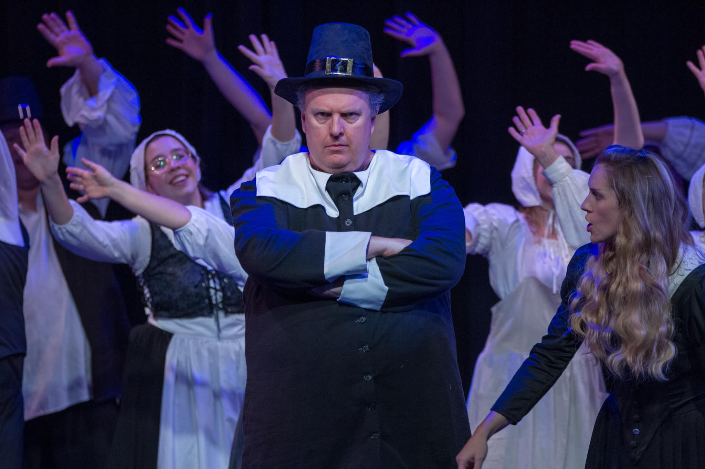

# 431 Class 17: 2022-11-03

[Main Website](https://thomaselove.github.io/431-2022/) | [Calendar](https://thomaselove.github.io/431-2022/calendar.html) | [Syllabus](https://thomaselove.github.io/431-syllabus-2022/) | [Notes](https://thomaselove.github.io/431-notes/) | [Contact Us](https://thomaselove.github.io/431-2022/contact.html) | [Canvas](https://canvas.case.edu) | [Data and Code](https://github.com/THOMASELOVE/431-data)
:-----------: | :--------------: | :----------: | :---------: | :-------------: | :-----------: | :------------:
for everything | for deadlines | expectations | from Dr. Love | ways to get help | lab submission | for downloads

## Today's Slides

Class | Date | Reveal JS (HTML) | Quarto .qmd | PDF file | Recording
:---: | :--------: | :------: | :------: | :--------: | :-------------:
17 | 2022-11-03 | **[Slides 17](https://thomaselove.github.io/431-slides-2022/class17.html)** | [Code 17](https://thomaselove.github.io/431-slides-2022/class17.qmd) | [PDF 17](431%20Class%2017.pdf) | Visit [Canvas](https://canvas.case.edu/), select **Zoom** and **Cloud Recordings**

## Announcements

1. I've gently tweaked [Lab 7's instructions (pdf)](https://github.com/THOMASELOVE/431-labs-2022/blob/main/lab07.pdf) and [data set (.xls)](https://github.com/THOMASELOVE/431-data/blob/main/lab07_trial.xls) to make things easier and clearer for you when doing that Lab (it's due right after Thanksgiving.)
2. Remember we don't have class next Tuesday (2022-11-08) because of Election Day. Instead, Class 18 will be pre-recorded class, and I'll make that available to you **as soon as possible**.

## What Should I Be Working On?

1. The Minute Paper for this week is due Friday at noon, and will be available **by class time**.
2. [Lab 5](https://github.com/THOMASELOVE/431-labs-2022) is due Monday 2022-11-07 at 9 PM.
3. The [Project B registration form](https://bit.ly/431-projB-registration-2022) is due at 5 PM on Friday 2022-11-11. This form will be all you need to obtain my approval for your plan, let me know if you’re working with a partner, and schedule your oral presentation. 
    - This deadline will not change, and you need to start Project B this weekend if you haven't already. 
    - We'll spend a few minutes talking about [Project B](https://thomaselove.github.io/431-projectB-2022/). Specifically, we'll talk about the [five things you need to do to be able to register your work](https://thomaselove.github.io/431-projectB-2022/register.html#what-do-you-need-to-do-before-filling-out-the-form).

## Want to know what this is all about?

Come see [Something Rotten at Hudson Players](https://www.hudsonplayers.com/something-rotten/) November 4-6, 11-13 and 18-19.
