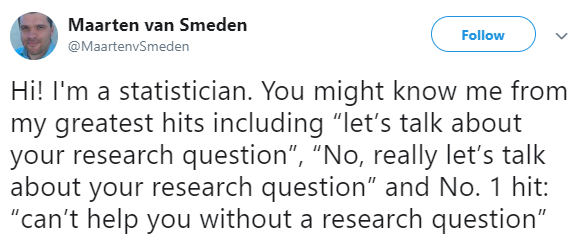

# 431 Class 19: 2022-11-10

[Main Website](https://thomaselove.github.io/431-2022/) | [Calendar](https://thomaselove.github.io/431-2022/calendar.html) | [Syllabus](https://thomaselove.github.io/431-syllabus-2022/) | [Notes](https://thomaselove.github.io/431-notes/) | [Contact Us](https://thomaselove.github.io/431-2022/contact.html) | [Canvas](https://canvas.case.edu) | [Data and Code](https://github.com/THOMASELOVE/431-data)
:-----------: | :--------------: | :----------: | :---------: | :-------------: | :-----------: | :------------:
for everything | for deadlines | expectations | from Dr. Love | ways to get help | lab submission | for downloads

## Today's Slides

Class | Date | Reveal JS (HTML) | Quarto .qmd | PDF file | Recording
:---: | :--------: | :------: | :------: | :--------: | :-------------:
19 | 2022-11-10 | **[Slides 19](https://thomaselove.github.io/431-slides-2022/class19.html)** | [Code 19](https://thomaselove.github.io/431-slides-2022/class19.qmd) | [PDF 19](431%20Class%2019.pdf) | Visit [Canvas](https://canvas.case.edu/), select **Zoom** and **Cloud Recordings**

## Announcements

1. The [Class 18 recording remains here](https://cwru.zoom.us/rec/share/eXf6w1TnN4QYSWm6I2GipI9jE7VdTJWOCi2HjDMGefqbYnbWZhJ392lv1KIJoVcg.8uoy_ilFkKk5L3d9) and is about 29 minutes long. We assume you will watch this before today's class.
2. The Lab 5 [answer sketch and grading rubric](https://github.com/THOMASELOVE/431-labs-2022#answer-sketches-and-grading-rubrics) is available to our Shared Drive.
    - Lab 5 grades should be available on 2022-11-14.
3. Feedback and Comments from the Minute Paper after Class 17 are available at https://bit.ly/431-2022-min17-feedback. 
    - Minute Paper, as well as Lab 1-4 grades are found in the [Course Grading Roster](https://bit.ly/431-grades-2022) on our Shared Drive.
4. Project A submission status [is available here](https://github.com/THOMASELOVE/431-classes-2022/blob/main/projectA/submission_status.md).

## Upcoming Deadlines

1. The [Project B registration form](https://bit.ly/431-projB-registration-2022) is due this Friday 2022-11-11 at 5 PM. 
2. [Lab 6](https://github.com/THOMASELOVE/431-labs-2022) is due Monday 2022-11-14 at 9 PM.
3. Before you finish the Lab, you should have read through Chapter 10 of Spiegelhalter.
4. The next Minute Paper will be due Wednesday 2022-11-16, after Class 20.

## One Last Thing

**On Asking Questions**: We know it can be difficult to ask for help, and while we try to be helpful in responding on Campuswire, over Zoom office hours, via email or through the Minute Papers, if we don't understand your question (or don't understand the purpose of it) we can often confuse matters. Moreover, if we think you already know something when you don't, that can also get in the way of giving you a useful response. 

Our goal is to understand what you're asking and help you, however we can. Please help us help you by being as specific as you can about where you're having trouble when you ask a question, and be persistent - we want to help you, really! We are, in fact, very grateful for every question we receive.
