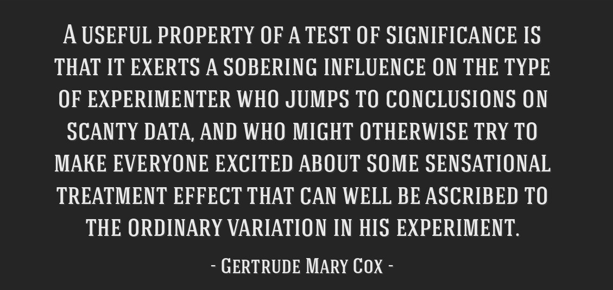

# 431 Class 23: 2022-12-06

[Main Website](https://thomaselove.github.io/431-2022/) | [Calendar](https://thomaselove.github.io/431-2022/calendar.html) | [Syllabus](https://thomaselove.github.io/431-syllabus-2022/) | [Notes](https://thomaselove.github.io/431-notes/) | [Contact Us](https://thomaselove.github.io/431-2022/contact.html) | [Canvas](https://canvas.case.edu) | [Data and Code](https://github.com/THOMASELOVE/431-data)
:-----------: | :--------------: | :----------: | :---------: | :-------------: | :-----------: | :------------:
for everything | for deadlines | expectations | from Dr. Love | ways to get help | lab submission | for downloads

## Today's Slides

Class | Date | Reveal JS (HTML) | Quarto .qmd | PDF file | Recording
:---: | :--------: | :------: | :------: | :--------: | :-------------:
23 | 2022-12-06 | **[Slides 23](https://thomaselove.github.io/431-slides-2022/class23.html)** | [Code 23](https://thomaselove.github.io/431-slides-2022/class23.qmd) | [PDF 23](431%20Class%2023.pdf) | Visit [Canvas](https://canvas.case.edu/), select **Zoom** and **Cloud Recordings**

## Announcements

1. I added the `mitml` package to our [list of recommended packages](https://github.com/THOMASELOVE/431-packages) for installation. 
2. I also [upgraded my version of R](https://cran.case.edu/) to version 4.2.2 effective with today's slides, and updated all of my R packages.
3. I fixed a typo in the Project B instructions that suggested there was a Quiz 3. There is no Quiz 3, and that now reads Quiz 2.
4. I updated the Lab 7 Grading Rubric on our Shared Drive to account for the fact that Question 7 is worth 15, not 10 points.
5. Grades and feedback on Lab 7 are now available on the [Course Grades Roster](https://bit.ly/431-grades-2022).
6. The [YouTube Playlist of your favorite songs](https://youtube.com/playlist?list=PL1WkTI58HjchPCLLYcV3q48LluH5z8aeN) (and two of mine) is now available. This was a request as part of the [Project B checklist](https://thomaselove.github.io/431-projectB-2022/checklist.html).
7. Grades and the answer sketch for Quiz 2 should be available by Noon tomorrow.

## How did the Quiz go?

- I've shared the Answer Sketch with those of you who completed the Quiz via email at noon today, and also sent an email to each of you specifying the general range of your result on the Quiz.
- You'll get your detailed grade from me (on each question and overall) in an email by noon tomorrow. 
- Roughly half of our students thought Quiz 1 was easier than Quiz 2, so I guess they were similar.

### The Questions on which students did least well were 07, 10, 11, 16, 17, 24, 25 and 28.

- On Question 07, I think the main problems were failing to convert to a factor when running ANOVA, and not recognizing which test was required.
- On Question 10, I think the main problems included failing to successfully lump together multi-categorical responses as requested, and identifying the appropriate odds ratio in a 2x2 table.
- On Question 11, I think the main problems included filtering the data successfully by year, and running and interpreting the appropriate `binom.test()` choice.
- On Question 16, I know the main problems involved parsing the question correctly and building appropriate power.t.test() code.
- On Question 17, I know the main problems were treating a high-influence outlier with a standardized residual around 4 in Model 2 as if it wasn't indicative of a problem with assumptions, and not recognizing that the residual plots in Model 4 looked fine.
- On Question 24, I think the main problems were that people didn't parse the question correctly, and were uncomfortable being asked to find something that is often assumed in a power calculation.
- On Question 25, I think the main problems were in paying attention to details in using `twobytwo()`.
- On Question 28, I know the main problems were with correctly describing your interpretation of the results provided, and this is a big part of Project B (Study 1.)

### Interpreting Your Score (once you get it) 

Add up your score on each of the 28 questions. The maximum possible score is 104 points, but we'll pretend it was out of 100 points (you might think of this as giving you each four points.)

- The highest score was 99.5 points.
- The median score was just under 89 points.
- The mean score was 85.5, which is right where I'd hoped it would be.

Interpretation | Score Range | Students
:------------: | :----: | :----:
Strong A | 95 to 99.5 | 10
Solid A | 90 to 94.5 | 16
Low A / High B | 86 to 89.5 | 9
Solid B | 75 to 85.5 | 15
Low B | 70 to 74.5 | 3
Weaker | Below 70 | several people

## Remaining Tasks (other than Project B)

1. Our final [Minute Paper (after Class 23)](https://bit.ly/431-2022-min-23) is due Wednesday 2022-12-07, and [is available now](https://bit.ly/431-2022-min-23).
2. (*optional*) [Lab X](https://github.com/THOMASELOVE/431-labs-2022/blob/main/labX.md) is due Monday 2022-12-12 at Noon.
3. (*optional*) Should you want Dr. Love to regrade one (or more) of Labs 1-7, fill out the [Lab Regrade Request Form](https://bit.ly/431-2022-lab-regrade-requests) by Monday 2022-12-12 at Noon.
4. (*optional*) [Lab Y](https://github.com/THOMASELOVE/431-labs-2022/blob/main/labY.md) is **new**, and is worth a little bonus credit to you (less than Lab X, if you're choosing between them, but you can do both). It is optional, and due (submit via Canvas) on Friday 2022-12-16 at Noon.

## Project B Tasks

1. Project B **presentations** will be held on December 8, 12, 13 and 15 according to [the schedule posted here](https://github.com/THOMASELOVE/431-classes-2022/blob/main/projectB/schedule.md). 
    - Read [the Checklist](https://thomaselove.github.io/431-projectB-2022/checklist.html) well in advance to make sure you complete everything you need to do and are prepared for this Oral Presentation of Results properly.
    - Zoom information for the Project B presentations is now available in the Announcements section of [Canvas](https://canvas.case.edu/).
    - If you're presenting to me in person, bring a laptop with the HTML or Powerpoint you want to show to me during your presentation.
2. The Project B **final reports** for [Study 1](https://thomaselove.github.io/431-projectB-2022/study1b.html) and for [Study 2](https://thomaselove.github.io/431-projectB-2022/study2b.html) and the [self-evaluation form](https://bit.ly/431-2022-projectB-self-evaluation) are due at noon on Monday 2022-12-19. 
    - You should submit both your [Study 1 report](https://thomaselove.github.io/431-projectB-2022/study1b.html) (Rmd and HTML) and your [Study 2 report](https://thomaselove.github.io/431-projectB-2022/study2b.html) (Rmd and HTML) - so a total of four documents to Canvas by that time. 
    - If you are working with a partner, exactly one of you should submit these four items. The other person should submit a one-page note to Canvas (word or PDF is best) containing your name, and stating something like “I worked on Project B with [your partner’s name] and they will submit Project B for our group.”
    - If you are working with data other than NHANES data, you will also submit your data.
3. The [Self-Evaluation for Project B Form](https://bit.ly/431-2022-projectB-self-evaluation) should take about 15 minutes to complete. If you are working in a team, each of you need to complete the form as an individual. The Form should be completed after meeting with Dr. Love for your presentation **and** after submitting your final reports to Canvas.

## References from Today's Class

- Sterne JAC et al [Multiple imputation for missing data in epidemiological and clinical research: potential and pitfalls](https://www.bmj.com/content/338/bmj.b2393) BMJ 2009; 338:b2393.
- The mice (Multivariate Imputation by Chained Equations) package [reference page](https://amices.org/mice/).
    - Stef van Buuren, Karin Groothuis-Oudshoorn (2011). [mice: Multivariate Imputation by Chained Equations in R](https://www.jstatsoft.org/article/view/v045i03). Journal of Statistical Software, 45(3), 1-67. DOI 10.18637/jss.v045.i03.
- Framingham Heart Study at https://www.framinghamheartstudy.org/
- Heymans MW and Eekhout I [Applied Missing Data Analysis with SPSS and RStudio](https://bookdown.org/mwheymans/bookmi/)
- The `mipo` (Multiple Imputation pooled object) help file [can be found here](https://rdrr.io/cran/mice/man/mipo.html).

## One Last Thing

 [Link to this tweet](https://twitter.com/schunemann_mac/status/1598228310756331520); [Wikipedia on the Bradford-Hill criteria](https://en.wikipedia.org/wiki/Bradford_Hill_criteria)

