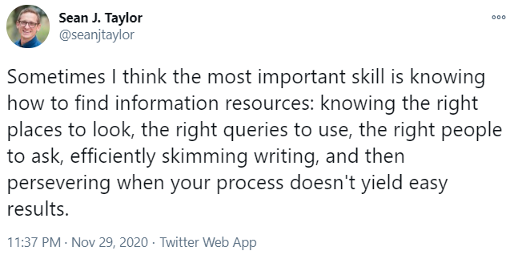
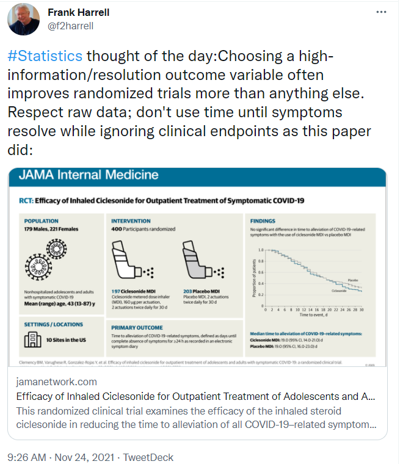

# 431 Class 24: 2022-12-08

[Main Website](https://thomaselove.github.io/431-2022/) | [Calendar](https://thomaselove.github.io/431-2022/calendar.html) | [Syllabus](https://thomaselove.github.io/431-syllabus-2022/) | [Notes](https://thomaselove.github.io/431-notes/) | [Contact Us](https://thomaselove.github.io/431-2022/contact.html) | [Canvas](https://canvas.case.edu) | [Data and Code](https://github.com/THOMASELOVE/431-data)
:-----------: | :--------------: | :----------: | :---------: | :-------------: | :-----------: | :------------:
for everything | for deadlines | expectations | from Dr. Love | ways to get help | lab submission | for downloads

## Today's Slides

Class | Date | Reveal JS (HTML) | Quarto .qmd | PDF file | Recording
:---: | :--------: | :------: | :------: | :--------: | :-------------:
24 | 2022-12-08 | **[Slides 24](https://thomaselove.github.io/431-slides-2022/class24.html)** | [Code 24](https://thomaselove.github.io/431-slides-2022/class24.qmd) | [PDF 24](431%20Class%2024.pdf) | Visit [Canvas](https://canvas.case.edu/), select **Zoom** and **Cloud Recordings**

## Announcements

1. Feedback on the Minute Paper after Class 23 [is now available](https://bit.ly/431-2022-min23-feedback).
2. You should have received at least two emails from Dr. Love since last class. If you didn't get them both, email me (or speak to me) now to let me know.
    - The first one had the subject line "431 Quiz 2 Detailed Results" and was sent Tuesday night (2022-12-06).
    - The second one had the subject line "431 Urgent: Please Check My Assessment Records" and was sent Wednesday night (2022-12-07). Note that the first poll I did on Campuswire (earlier in the semester) will be part of the Campuswire score not yet determined.
3. I fixed the Project B instructions so they correctly indicate **December 19 at noon** as the deadline for the final project reports.
4. I created a folder on our Shared Drive called "Slides from 431 Fall 2022 Classes" that includes a PDF of the first 12 sets of class slides, and another PDF of the last 12 sets. 
5. Everything in the 431 Fall 2022 Dr Love and Students Shared Drive folder will remain where it is until 2023-02-01.
6. Everything on Github including the Course Notes will remain where it is until 2023-06-01.
7. I didn't manage to [get back to the movies data in a meaningful way](https://github.com/THOMASELOVE/431-classes-2022/tree/main/movies), but I did build a new data set (including your responses on Minute Papers) and I will use these data meaningfully in 432. Sorry.
8. After today, when Dr. Love has information for you, he will post it to the [post-class page](https://github.com/THOMASELOVE/431-classes-2022/tree/main/postclass). What's there now is a description of what we'll be doing in 432 and in 500 (and see below), but more will appear.

## Remaining Tasks (other than Project B)

1. CWRU will ask you to complete a course evaluation. Please do so, by their deadline.
2. (*optional*) [Lab X](https://github.com/THOMASELOVE/431-labs-2022/blob/main/labX.md) is due **Monday 2022-12-12 at Noon**.
3. (*optional*) Should you want Dr. Love to regrade one (or more) of Labs 1-7, please be sure to fill out the [Lab Regrade Request Form](https://bit.ly/431-2022-lab-regrade-requests), which is also due **Monday 2022-12-12 at Noon**.
4. (*optional*) [Lab Y](https://github.com/THOMASELOVE/431-labs-2022/blob/main/labY.md) is **new**, and is worth a little bonus credit to you (less than Lab X, if you're choosing between them, but you can do both). It is optional, and due (submit via Canvas) on **Friday 2022-12-16 at Noon**.

## Project B Tasks

1. Project B **presentations** will be held on December 8, 12, 13 and 15 according to [the schedule posted here](https://github.com/THOMASELOVE/431-classes-2022/blob/main/projectB/schedule.md). 
    - Read [the Checklist](https://thomaselove.github.io/431-projectB-2022/checklist.html) well in advance to make sure you complete everything you need to do and are prepared for this Oral Presentation of Results properly.
    - Zoom information for the Project B presentations on December 12, 13 and 15 is available in the Announcements section of [Canvas](https://canvas.case.edu/).
    - If you're presenting to me in person, arrive at my office (Wood WG-82J) on the ground floor of the Wood building at the School of Medicine. When you arrive outside my office, do not knock on the door, so as not to disturb the previous group. I will open the door when I am available. Bring a working laptop with the HTML or Powerpoint you want to show to me during your presentation. Be sure to also have the two HTML files (for Study 1 and Study 2) available.
2. The Project B **final reports** for [Study 1](https://thomaselove.github.io/431-projectB-2022/study1b.html) and for [Study 2](https://thomaselove.github.io/431-projectB-2022/study2b.html) and the [self-evaluation form](https://bit.ly/431-2022-projectB-self-evaluation) are due at noon on Monday 2022-12-19. 
    - You should submit both your [Study 1 report](https://thomaselove.github.io/431-projectB-2022/study1b.html) (Rmd and HTML) and your [Study 2 report](https://thomaselove.github.io/431-projectB-2022/study2b.html) (Rmd and HTML) - so a total of four documents to Canvas by that time. 
    - If you are working with a partner, exactly one of you should submit these four items. The other person should submit a one-page note to Canvas (word or PDF is best) containing your name, and stating something like “I worked on Project B with [your partner’s name] and they will submit Project B for our group.”
    - If you are working with data other than NHANES data, you will also submit your data.
    - **NEW** As I evaluate your Project B presentations, I will fill out a Google Form that [looks a lot like this PDF](Sample%20Form%20for%20Presentation%20Evaluation.pdf). I will not share this with you after your talk - it's for my benefit, but it will give you an idea of what I'm doing between talks, and what I'm evaluating during your presentation.
3. The [Self-Evaluation for Project B Form](https://bit.ly/431-2022-projectB-self-evaluation) should take about 15 minutes to complete. If you are working in a team, each of you need to complete the form as an individual. The Form should be completed after meeting with Dr. Love for your presentation **and** after submitting your final reports to Canvas.

## Taking Other Courses (like 432) With Me

In addition to 431, I teach two other semester-long courses, called **PQHS 432** and **PQHS 500**. I will teach both 432 and 500 in Spring 2023. Here's my advice, for what it's worth ...

- **432** is the continuation of this course (widely regarded as the "better" half.) I think **everyone** in this class should be planning to take 432 this Spring (i.e. Spring 2023), **unless** you don't feel you've received sufficient value from this course and don't need to take 432 to finish your program at CWRU, **or** you have an unshakable conflict in Spring 2023 (especially if you plan to instead take 432 in Spring 2024.)
    - I will provide the 432 website and syllabus to everyone enrolled in 432 about a week before the class begins on January 10. The Spring 2022 syllabus for 432 is [here](https://thomaselove.github.io/432-2022-syllabus/) but of course, things will change between now and January 10, in ways I will start to think about after 431 is complete on December 20.
    - If you want to "get ahead" a bit on 432 over the break, do some work on the transition from R Markdown to [Quarto](https://quarto.org/docs/get-started/hello/rstudio.html).
    - Some details on 432 are available on our [post-class page](https://github.com/THOMASELOVE/431-classes-2022/tree/main/postclass).
- **500** is a project-based and more advanced course covering specific topics in the design and analysis of observational studies. 
    - I think everyone in this class who is interested in taking 500 should do so at some point. The course is mostly about using propensity scores well to help design (and analyze) data from observational studies where we want to estimate a causal effect.
    - A revised syllabus for the Spring 2023 version of the course will be available on or around January 10. The Spring 2022 syllabus for 500 is [here](https://thomaselove.github.io/500-2022-syllabus/), but of course, things will change between now and January 10, in ways I will start to think about after 431 is complete on December 20.
    - I especially think MS and PhD students (in any department) interested in applications of health research in real world situations should take it, as well as people looking for jobs in fields related to health care analytics.
    - For some people, it's better to complete 432 before taking 500 for several reasons, most especially ...
        1. percolation time for some of the ideas in 431/432
        2. too much of me at one time can be overwhelming
    - If Spring 2023 is your best opportunity to take 500, then I will certainly permit you to do so. Send me an email anytime if you want to discuss this.

## References from Today's Slides

- [Common statistical tests are linear models](https://lindeloev.github.io/tests-as-linear/) by Jonas Kristoffer Lindeløv.
- [Get Started with Tidymodels](https://www.tidymodels.org/start/). The sea urchins example comes from [Build a Model](https://www.tidymodels.org/start/models/).
- [TidyTuesday and tidymodels](https://juliasilge.com/blog/intro-tidymodels/) by [Julia Silge](https://juliasilge.com/).
- I have a semi-surprise visualization example, which (after the surprise has been revealed) might interest you in reading more from [Alberto Cairo](http://www.thefunctionalart.com/2016/08/download-datasaurus-never-trust-summary.html), [Steph Locke](https://cran.r-project.org/web/packages/datasauRus/vignettes/Datasaurus.html), [Tomas Westlake](https://r-mageddon.netlify.com/post/reanimating-the-datasaurus/), [Julia Silge](https://juliasilge.com/blog/datasaurus-multiclass/) and [Justin Mareika and George Fitzmaurice](https://www.autodesk.com/research/publications/same-stats-different-graphs) in addition to what you've already read about it in Spiegelhalter. 

# Ten of the Most Important Ideas from 431

1. You have to visualize and count data to understand it.
2. 90% of statistical work could be described as data management.
3. R Markdown and the tidyverse make it easier to do the right thing.
4. Statistical significance is not a helpful concept.
5. Point estimates and confidence intervals are useful ideas.
6. Most statistical procedures are in fact regression models.
7. All statistical methods involve assumptions worth checking.
8. The bootstrap is a very useful, and somewhat underused tool.
9. Prediction models need to predict well in new situations.
10. Statistical thinking is far too important to be left to statisticians.

